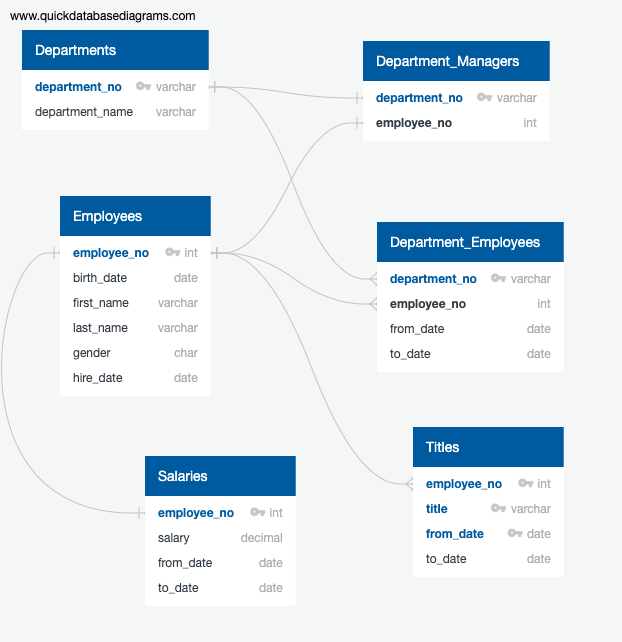
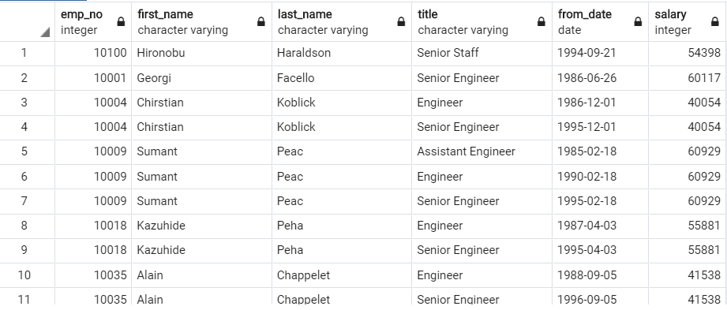
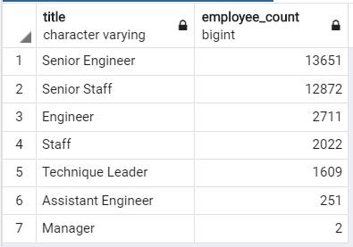
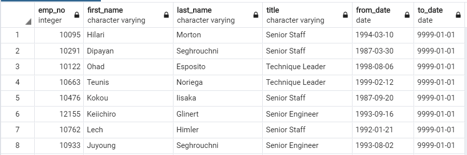

# lgomez-Pewlett-Hackard-Analysis
## Project Overview
1.	Identify and create the list of employees who will be retiring from the company based date of birth.
2.	Create a list of positions that need to be filled up once the retirement eligible employees retire.
3.	Create a list of employees who will retire from Sales and Development.
4.	Create a list of employees retiring from each department.
## Resources
- Data Source: employees.csv, dept_info.csv, dept_emp.csv, dept_manager.csv, salaries.csv and  titles.csv
- Software: PostgresSQL 11.7, pgAdmin and QuickDatabaseDiagrams
 ## Entity-Relationship-Diagram:
 
 
## Challenge Overview
1.	Create a list of retirees who are currently employed in Pewlett-Hackard and their repective titles based on if their Date of birth was between 1st Jan 1952 and the 31st Dec 1955.
2.	Find out the number of employees retiring for various titles .
3. Create a list of current employees who are eligible for Mentor roles.
## Challenge Summary
### All queries to retrieve data is located at Queries/challengeQueries.sql
1. Retiree list : 

2. The number of the employees retiring from various titles (positions) which needs to be filled in future:

3. The list of employees who are ready for Mentor role are as follows:

# Conclusion:
From the above data we can see that Pewlett Hackard will have 33,118 employees retiring, there are 1,549 who are eligible for mentor roles, and there will be close to 30,000 people that would need to be hired to fill retiree positions.
